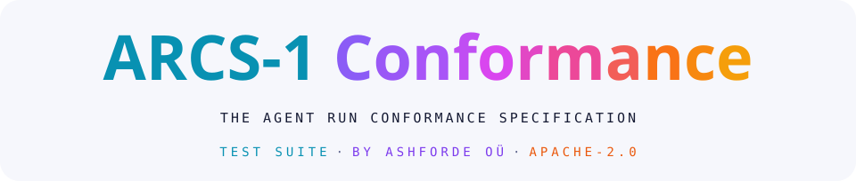
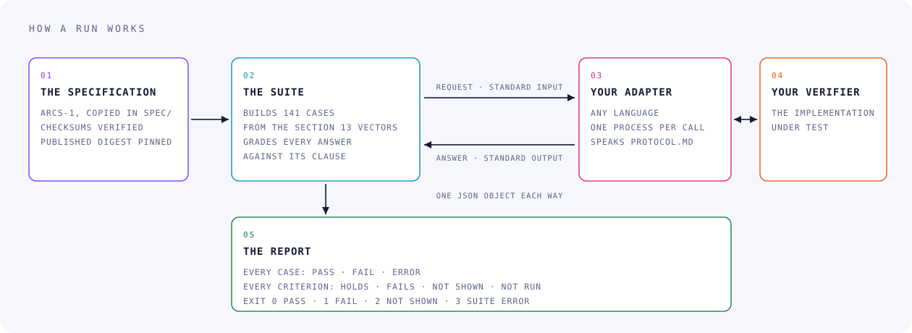
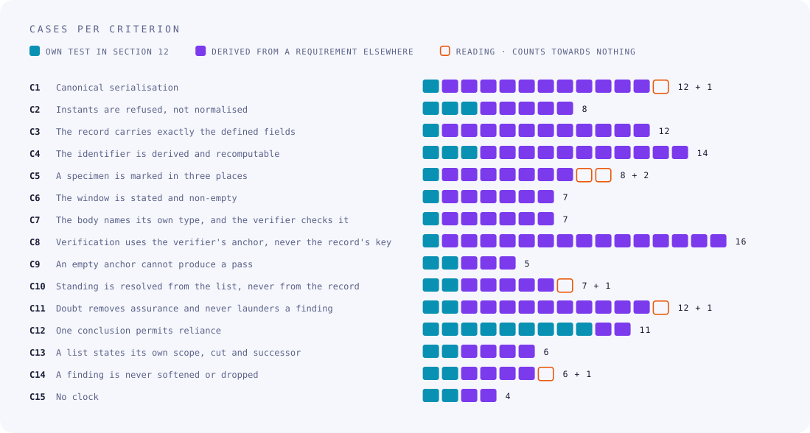

<!-- gen:mark -->
<p align="center">
  <picture>
    <source media="(prefers-color-scheme: dark)" srcset="docs/assets/mark-dark.svg">
    
  </picture>
</p>
<!-- /gen:mark -->

<!-- gen:title -->
<p align="center">
  <picture>
    <source media="(prefers-color-scheme: dark)" srcset="docs/assets/title-dark.svg">
    
  </picture>
</p>
<!-- /gen:title -->

<p align="center">
  <strong>The open test suite for the software that checks signed conformance records under the Agent Run Conformance Specification (ARCS-1), the aerospace profile of TRACE (Trust, Runtime Attestation and Compliance Evidence), published by Ashforde OÜ with ARCS-1's one canonical copy.</strong><br>
  A checker that trusts the key a record carries about itself accepts a forgery with its signature intact. One command, offline and without asking anyone, shows whether yours refuses what the specification says it must. A pass is evidence, never a certification.
</p>

<!-- gen:statline -->
<p align="center">
  <picture>
    <source media="(prefers-color-scheme: dark)" srcset="docs/assets/statline-dark.svg">
    
  </picture>
</p>
<!-- /gen:statline -->

<!-- gen:badges -->
<p align="center">
  <a href="LICENSE"></a>
  <a href=".github/workflows/ci.yml"></a>
  <a href="#what-it-is"></a>
  <a href="#coverage"></a>
  <a href="#coverage"></a>
</p>
<p align="center">
  <a href="https://github.com/ashfordeOU/arcs-conformance/actions/workflows/ci.yml"></a>
  <a href="https://github.com/ashfordeOU/arcs-conformance/releases"></a>
  <a href="spec/ARCS-1.md"></a>
  <a href="PROTOCOL.md"></a>
  <a href="reference/adapter.py"></a>
</p>
<!-- /gen:badges -->

<p align="center">
  <a href="#quick-start">Quick start</a> ·
  <a href="#how-it-works">How it works</a> ·
  <a href="#the-adapter-protocol">Adapter protocol</a> ·
  <a href="#coverage">Coverage</a> ·
  <a href="#reading-a-report">Reading a report</a> ·
  <a href="#what-a-pass-means-and-what-it-does-not">What a pass means</a> ·
  <a href="#questions">Questions</a> ·
  <a href="#glossary">Glossary</a> ·
  <a href="#licence">Licence</a> ·
  <a href="#about-ashforde-oü">About</a>
</p>

---

**What this repository is.** A free, open test suite for the software that
checks *conformance records*. A conformance record is a small signed
document, written in JSON (JavaScript Object Notation), in which an issuer
states that a named runtime checked named bodies of files, each identified
by its digest, for a named customer over a stated period. The rules for
writing, identifying, signing, checking and withdrawing such records are
public: they are the Agent Run Conformance Specification, ARCS-1, whose
one canonical copy is in [`spec/`](spec/ARCS-1.md) in this repository.
ARCS-1 is the aerospace profile of TRACE (Trust, Runtime Attestation and
Compliance Evidence), the open specification for signed evidence about
what a software agent ran: it defers to TRACE for everything TRACE defines,
and adds only what an aerospace claim needs, namely the gate verdicts, the
named person who signs off, and the exact corpus and harness versions.
This suite tests the program on the receiving end, the *verifier*, which
the holder of a record runs to decide whether it can be relied on. It asks
the verifier questions built from the specification's own worked examples,
grades every answer against the clause of ARCS-1 that settles it, and
reports the result criterion by criterion.

**Who publishes it.** Ashforde OÜ, a private limited company (osaühing,
OÜ) registered in Tallinn, Estonia, which also publishes ARCS-1. The
records ARCS-1 describes are issued by the Aero Harness, Ashforde OÜ's
inspection runtime: a private program that runs a battery of automated
checks over bodies of files, records which files it checked by their
digests, and signs the result. A harness here is meant in the software
sense of a test harness, not a wiring harness. The specification names no
vendor, and the specification and this suite are public so that nobody
who holds one of its records has to take Ashforde OÜ's word for it.

**Why it matters.** A signed document is only as trustworthy as the program
that checks it. A verifier that trusts the public key a record carries
about itself will accept a forgery with its signature intact, because a
forger ships their own key too. One that reads a withdrawn record as merely
out of date keeps it in use after its issuer has withdrawn it. If you
receive such records from a supplier, or build, buy or audit the tool that
checks them, this suite shows, with one command and no network connection,
whether that tool refuses what ARCS-1 says it must refuse, and accepts only
what it may accept.

It needs Python 3.9 or later and nothing else: no packages, no network, no
account, and no one to ask. The specification is free to implement and the
suite is free to run. What the suite cannot do is make anyone's claim for
them: a pass is evidence about the cases it ran, and never a certification
(see [What a pass means, and what it does not](#what-a-pass-means-and-what-it-does-not)).

Terms of art, such as *verifier*, *trust anchor* and *reading*, are
defined in plain words in the [Glossary](#glossary), which also spells out
every abbreviation. References such as §11 are to sections of ARCS-1 (§11
is section 11), and C1 to C15 are the fifteen conformance criteria its
section 12 defines, each named in words under [Coverage](#coverage).

**Status: published** at <https://github.com/ashfordeOU/arcs-conformance>,
and maintained by [Ashforde OÜ](#about-ashforde-oü). The version and the
edition of ARCS-1 it grades against are under [Versioning](#versioning). No
result from an implementation outside Ashforde OÜ has been reported yet.

The statline, the badges, every image, the run excerpt and the tables of
options, operations, coverage, glossary terms and versions are generated
from the tree by `tools/gen_readme.py` and `tools/gen_assets.py`, and a
test fails when any of them is stale. The prose around them, and the
tables of results, verdicts, exit statuses, repository layout and
continuous-integration steps, are written by hand; the figures they state
are read back by `tests/test_docs.py`, which also holds the
continuous-integration table to the workflow's own steps.

## Contents

- [Why a conformance suite](#why-a-conformance-suite) · [What it is](#what-it-is) · [What it is not](#what-it-is-not)
- [Quick start](#quick-start) · [How it works](#how-it-works) · [The adapter protocol](#the-adapter-protocol) · [Coverage](#coverage)
- [Reading a report](#reading-a-report) · [What a pass means, and what it does not](#what-a-pass-means-and-what-it-does-not) · [Reporting a result, and asking about the specification](#reporting-a-result-and-asking-about-the-specification)
- [How the suite tests itself](#how-the-suite-tests-itself) · [Repository layout](#repository-layout) · [Questions](#questions) · [Glossary](#glossary) · [Roadmap](#roadmap)
- [Contributing](#contributing) · [Citing](#citing) · [Versioning](#versioning) · [Licence](#licence) · [About Ashforde OÜ](#about-ashforde-oü) · [Related repositories](#related-repositories)

## Why a conformance suite

**A claim anyone can check without the issuer.** ARCS-1 is written so that
the person relying on a conformance record can check it without trusting,
or even contacting, the party that issued it: the specification says what
the bytes are, how the identifier is derived, whose key must have signed,
and which conclusion a verifier must reach (§1). That promise holds only
if the verifier doing the checking follows the text. A verifier that trusts
the key a record carries about itself, or reads a withdrawn record as
merely stale, will report a clean result on a document that should have
been refused, and the reader is misled with the signature intact.

**A specification says what to do; a suite shows who does it.** Reading
ARCS-1 lets an implementer believe they have implemented it. Running this
suite lets them, and anyone who doubts them, find out. For that to be worth
anything the suite has to need nothing from the issuer either, so it runs
offline, reads the specification from a checksummed copy of the published
text, builds every artefact it hands over from the worked examples in §13
and from test keys anyone can regenerate, and publishes every case it runs.
Nothing is hidden from the implementation being graded, and nothing has to
be requested from Ashforde OÜ.

**Cases and criteria, never a score.** ARCS-1 defines conformance per
criterion: an implementation conforms to `claim@1`, the conformance claim
format, version 1, when every criterion of §12 holds. A single count of
cases passed invites the reading that the few missing are a rounding error,
when a handful of failed cases can be one criterion broken several ways. So
the report lists every case, then every criterion with its own counts and
verdict, and its closing line names criteria and totals nothing.

**A protocol, not a library.** The implementations worth testing are
written in languages the suite does not speak. The one interface every
language has is a command that reads standard input and writes standard
output, so that is the whole of what an implementation must offer, through
a small *adapter* its authors write once.

## What it is

- **A catalogue of cases.** Each *case* is one request, the clause of
  ARCS-1 that makes the request a fair question, and the set of answers
  that clause allows. Every artefact is rebuilt from the specification's
  own worked examples each time the suite runs, so a stored file can never
  drift from the rule it was made to break.
- **A runner** that speaks one protocol to any command: a JSON request on
  standard input, a JSON answer on standard output, one process per call,
  a time limit per call, and the call's whole process group ended when the
  limit passes.
- **A grader and a report**: a verdict per case and per criterion, a
  closing line that totals nothing, a JSON form of the whole report, and
  exit statuses a continuous integration (CI) system can act on.
- **A reference adapter**, written from ARCS-1 alone, which holds every
  criterion. It shows that every normative case can be passed, and it is a
  working template for an adapter of your own.
- **Its own tests**: a broken adapter with named defects, each pinned to
  the cases it must fail; a program that checks nothing, which must fail
  every criterion; and the answers every case allows, pinned a second time
  by hand.
- **Python** from 3.9, using the standard library alone, licensed under the
  Apache License, Version 2.0, and maintained by Ashforde OÜ.

## What it is not

- **Not a verifier.** The reference adapter is minimal on purpose, and
  passing the suite shows that the suite can be passed. Nothing in this
  repository should be used to decide anything about a real record.
- **Not a certification, an approval or an endorsement** by Ashforde OÜ or
  by anyone. ARCS-1 says it in as many words in §16: conformance to the
  specification is not certification by Ashforde OÜ. A result from this
  suite is evidence, and says which cases it rests on.
- **Not the reference implementation** that ARCS-1 mentions. That is the
  Aero Harness runtime, which is private. The reference adapter here was
  written from the published text without sight of it, and shares only the
  Ed25519 signature code with the suite (Ed25519 being one instance of the
  Edwards-curve Digital Signature Algorithm, EdDSA).
- **Not an assessment of a corpus or of an obligation.** ARCS-1 §1 leaves
  what makes a *corpus* fit, or an obligation met, outside the
  specification, and the suite leaves it outside too. It tests whether a
  verifier checks a document correctly, which is exactly the part a
  stranger must be able to check.
- **Not a test of any record in circulation.** The suite builds its own
  artefacts from the published worked examples and *specimen*, and asks
  about those.
- **Not a judge of the adapter's honesty.** The suite grades the answers it
  is given. An adapter that answers from a table of expected results passes
  and has shown nothing, which is why a result worth quoting carries the
  command line and the adapter's source.
- **Not a check of time-stamps.** ARCS-1 does not define one, so no case
  tests one, although the published specimen carries, in its free-form
  `provenance`, a time-stamp token under RFC 3161 (Request for Comments
  3161, the Internet X.509 Public Key Infrastructure Time-Stamp Protocol,
  X.509 being the standard format for public-key certificates): a statement
  by a time-stamping authority that given data existed at a given time.

## Quick start

You need Python 3.9 or later and a copy of this repository. Nothing is
installed:

```sh
git clone https://github.com/ashfordeOU/arcs-conformance.git
cd arcs-conformance
```

Then two commands, from the root of the repository:

```sh
python3 -m arcs_conformance --impl 'python3 reference/adapter.py'
python3 -m arcs_conformance --impl '<the command that runs your adapter>'
```

The first runs the suite against the reference adapter, which passes every
case, and so shows that the suite works on your machine. The second runs
it against yours. An adapter is whatever command answers the suite's
requests for your implementation, and [PROTOCOL.md](PROTOCOL.md) is the
whole of what it must do.

This is what the first command prints, with most of the case lines cut. It
is a real run, regenerated whenever the suite changes. Each case line gives
the result, the criterion, the case's identifier (ID) and the clause of
ARCS-1 it rests on:

<!-- gen:excerpt -->
```text
$ python3 -m arcs_conformance --impl 'python3 reference/adapter.py'
arcs-conformance 2.1.0, protocol arcs-conformance-adapter/1
specification: ARCS-1, edition 2026-09-26 (ARCS-1.md sha256 6d68f8d5d9ea2ec130dacb9c9d2af50cae67008f3a2b77911e5b66f58d05ccec, the published text this suite pins)
implementation: python3 reference/adapter.py
  describes itself as: arcs-minimal-adapter 1.0.0 (not checked)

Cases
PASS  C1   c1-vector-canonical-ordering                         §3; §13 canonical-ordering
PASS  C1   c1-escaped-input-emitted-literally                   §3
PASS  C1   c1-keys-sort-by-code-point                           §3
[138 more case lines]

Criteria (normative cases only; readings change none of these)
  C1   Canonical serialisation                                          12 cases  12 pass   0 fail   0 error  holds
  C2   Instants are refused, not normalised                              8 cases   8 pass   0 fail   0 error  holds
  C3   The record carries exactly the defined fields                    12 cases  12 pass   0 fail   0 error  holds
  C4   The identifier is derived and recomputable                       14 cases  14 pass   0 fail   0 error  holds
  C5   A specimen is marked in three places                              8 cases   8 pass   0 fail   0 error  holds
  C6   The window is stated and non-empty                                7 cases   7 pass   0 fail   0 error  holds
  C7   The body names its own type, and the verifier checks it           7 cases   7 pass   0 fail   0 error  holds
  C8   Verification uses the verifier's anchor, never the record's key  16 cases  16 pass   0 fail   0 error  holds
  C9   An empty anchor cannot produce a pass                             5 cases   5 pass   0 fail   0 error  holds
  C10  Standing is resolved from the list, never from the record         7 cases   7 pass   0 fail   0 error  holds
  C11  Doubt removes assurance and never launders a finding             12 cases  12 pass   0 fail   0 error  holds
  C12  One conclusion permits reliance                                  11 cases  11 pass   0 fail   0 error  holds
       and the reliance boolean on 98 verify_record answers: 98 agree with their conclusion, 0 do not
  C13  A list states its own scope, cut and successor                    6 cases   6 pass   0 fail   0 error  holds
  C14  A finding is never softened or dropped                            6 cases   6 pass   0 fail   0 error  holds
  C15  No clock                                                          4 cases   4 pass   0 fail   0 error  holds

Readings (questions ARCS-1 leaves open; recorded, counted towards nothing)
  C1   c1-reading-string-escapes                            agrees with the suite's reading
  C5   c5-reading-marked-specimen-verifies                  agrees with the suite's reading
  C5   c5-reading-record-matches-its-corpora                agrees with the suite's reading
  C10  c10-reading-no-status-list                           agrees with the suite's reading
  C11  c11-reading-unsigned-list-against-signed-record      agrees with the suite's reading
  C14  c14-reading-finding-postponed                        agrees with the suite's reading

Result: hold: C1-C15. Every criterion ARCS-1 section 12 defines holds on these cases. That is evidence about these cases and this build, not a certification, and not an approval by anyone.
$ echo $?
0
```
<!-- /gen:excerpt -->

On Linux, macOS and other systems that follow POSIX (the Portable Operating
System Interface standards), the `--impl` text is split into arguments as a
POSIX shell would split it and executed directly, never through a shell, so
pipes and redirections do nothing: put them in a script and name the
script. On Windows the text is handed to the system as the command line, as
written. Every option the command line takes, read from the suite's own
argument parser:

<!-- gen:options -->
| option | what it does |
| --- | --- |
| `--impl COMMAND` | the adapter command, split as a POSIX shell would split it and never run through one (on Windows, the command line as written) |
| `--spec DIR` | a copy of the published ARCS-1 directory (default: the copy in spec/) |
| `--timeout TIMEOUT` | seconds allowed for each call (default 30) |
| `--jobs JOBS` | calls in flight at once (default 1; raise it only for an adapter that tolerates it) |
| `--only C1,C8` | run only the cases of these criteria |
| `--case ID` | run only this case (repeatable) |
| `--json PATH` | also write the full report as JSON |
| `--verbose` | print the detail of passing cases too |
| `--list` | list the cases and exit |
| `--dump DIR` | write each case's request and expectation as JSON into DIR and exit |
| `--version` | print the suite's name and version |
<!-- /gen:options -->

## How it works

<!-- gen:diagram -->
<p align="center">
  <picture>
    <source media="(prefers-color-scheme: dark)" srcset="docs/assets/how-it-works-dark.svg">
    
  </picture>
</p>
<!-- /gen:diagram -->

1. **It reads the specification.** The worked examples of §13, the
   criterion titles of §12, the conclusions of §11, the edition and the
   specimen are read from the copy in `spec/` every time the suite runs,
   and never retyped. A copy that fails its own checksum file,
   `spec/SHA256SUMS`, is refused before a case runs. A checksum file can
   be regenerated over an edited text, so the suite also pins the SHA-256
   digest (Secure Hash Algorithm, 256-bit) of the published text: a copy
   that is not that text still runs, because a draft of the next edition
   is worth testing against, and the report then says in its header and
   its closing line that the result is about that copy and not about
   ARCS-1 as published.
2. **It builds the artefacts.** Every record, *status list* and *trust
   anchor* is built afresh from the worked examples of §13, the published
   specimen and the suite's test keys. Each is handed over as text, never
   as a parsed object, because some cases are about text no parser would
   carry through unchanged: a key given twice, a `NaN` (not a number), a
   decimal written `1.0`. The text is never in the canonical form of §3
   (it is indented, with its top-level keys in reverse order), so a
   verifier that hashes the bytes it was given, rather than the canonical
   form of what they say, never reaches `current` on a document the suite
   built.
3. **It calls your adapter**, one process per call, with one JSON request
   on standard input, and reads one JSON answer from standard output.
4. **It grades the answer against the clause.** Where ARCS-1 names the
   answer, the case accepts that answer and no other. Where it says only
   that a document is refused, the case accepts any refusing answer,
   because naming one of them would be the suite writing the specification
   rather than testing it. PROTOCOL.md section 3 gives the whole rule.
5. **It reports** every case, then every criterion, then a closing line,
   and exits with a status a CI system can act on.

**Controls.** A case that asks only for a refusal is passed by a program
that refuses everything. So wherever a criterion's other cases ask for
nothing else, it also carries a *control*: the same artefacts with the one
defect absent, which must be accepted. A refusal counts only beside an
acceptance of its twin. No constant answer to any operation passes all of
a criterion's cases of that operation, except the corpus-matching question
of C5 (a specimen is marked in three places), where ARCS-1 states only the
false side, and a program that checks nothing fails every criterion. The
suite's own tests hold it to both.

**Test keys.** Every artefact the suite signs is signed by one of its test
keys, each derived from a sentence published in PROTOCOL.md section 4.
Ed25519 signing is deterministic, so anyone holding that sentence and the
specification can regenerate every artefact byte for byte. The same fact
means the keys protect nothing, and they must never appear in a trust
anchor anybody relies on.

## The adapter protocol

The protocol is called `arcs-conformance-adapter/1`, version 1 of the
adapter protocol, and [PROTOCOL.md](PROTOCOL.md) is its complete
statement: how the suite calls an adapter, every request and answer, how
answers are graded, the shape of trust anchors, and the questions ARCS-1
leaves open. It opens with the fifteen criteria in the specification's own
words and the operations whose cases test each. In summary, an adapter is
asked to do one of these things per call:

<!-- gen:operations -->
| operation | the adapter is asked to | request fields | it answers | ARCS-1 | cases |
| --- | --- | --- | --- | --- | --- |
| `canonicalise` | serialise a JSON value as §3 defines | `value` | `canonical_hex`, or `refused` | §3 | 10 |
| `derive_id` | derive the identifier a document's payload gives | `document` | `id` | §6 | 6 |
| `verify_record` | verify a record against an anchor, at an instant, with or without a status list | `document`, `anchor`, `at`, `status_list` | `conclusion`, `relied` | §11 | 101 |
| `reliance` | say whether a conclusion permits reliance | `conclusion` | `relied` | §11 | 9 |
| `matches` | say whether a record covers a set of corpora | `document`, `corpora` | `matches` | §9 | 2 |
| `check_successor` | say whether one status list may follow another | `previous`, `successor` | `accepted` | §10 | 7 |
| `build_record` | build a record from its fields | `fields` | `document`, or `refused` | §5, §6 | 6 |
<!-- /gen:operations -->

- **Exit status 0** means the object on standard output is the answer. A
  refusal is an answer and exits 0.
- **Exit status 3** means the adapter does not implement this operation.
  The case is an ERROR, never a PASS.
- **Any other exit status**, no answer within the time allowed, or anything
  on standard output that is not one JSON object makes the case an ERROR.
  Standard error is free: its last lines are printed against an ERROR and
  never graded.
- **`describe`** is optional and never graded: an adapter may answer it
  with a name and version, which the report prints beside the words *not
  checked*.

**Writing an adapter.** Start from [`reference/adapter.py`](reference/adapter.py),
which answers every operation in standard-library Python and marks each
place where it follows the suite's reading of an open question. Run
`python3 -m arcs_conformance --dump cases/` to write every request with its
expected answer as a JSON file per case, and read a few before writing
code. Wrap your own verifier rather than reimplementing it in the adapter:
the adapter should translate, not decide. Iterate with `--only C8` or
`--case ID`, and run the whole suite before quoting anything. The `case`
field in each request is for your logs only; an adapter whose answer
depends on it is not being tested.

## Coverage

<!-- gen:totals -->
**141 cases in seven operations: 135 normative cases across all fifteen criteria of ARCS-1 §12, and 6 readings.** Of the normative cases, 33 follow the test §12 itself states for a criterion (*own test*) and 102 rest on a *must* stated elsewhere in the text (*derived*); 16 of them are controls, which must be accepted so that a criterion's refusals mean something.
<!-- /gen:totals -->

<!-- gen:chart -->
<p align="center">
  <picture>
    <source media="(prefers-color-scheme: dark)" srcset="docs/assets/coverage-dark.svg">
    
  </picture>
</p>
<!-- /gen:chart -->

<!-- gen:coverage -->
| | title in ARCS-1 §12 | what an implementation has to show | own test | derived | controls | normative | readings |
| --- | --- | --- | ---: | ---: | ---: | ---: | ---: |
| **C1** | Canonical serialisation | Serialises values to the exact bytes §3 defines, and refuses a float, a NaN or a key given twice, whether asked directly or inside a signed record. | 1 | 11 | 1 | 12 | 1 |
| **C2** | Instants are refused, not normalised | Refuses an instant with an offset, a fractional second, lower case or a date that does not exist, in a record, a status list or a build, rather than repairing it. | 3 | 5 | 2 | 8 | 0 |
| **C3** | The record carries exactly the defined fields | Refuses a record that adds a field, lacks a required one or carries a malformed value, even when its identifier is sound. | 1 | 11 | 1 | 12 | 0 |
| **C4** | The identifier is derived and recomputable | Derives identifiers from the document alone, and finds a record unsound when its serial does not recompute, however it was altered. | 3 | 11 | 1 | 14 | 0 |
| **C5** | A specimen is marked in three places | Refuses a specimen whose three marks disagree, and never matches a specimen against any corpus set. | 1 | 7 | 1 | 8 | 2 |
| **C6** | The window is stated and non-empty | Refuses a window that is empty, inverted or opens before issue, and answers not_yet_valid or expired outside a sound one. | 1 | 6 | 1 | 7 | 0 |
| **C7** | The body names its own type, and the verifier checks it | Refuses a document offered in the wrong place or signed for another purpose, however valid its signature. | 1 | 6 | 1 | 7 | 0 |
| **C8** | Verification uses the verifier's anchor, never the record's key | Trusts only the keys the verifier's anchor lists, and refuses forged, relabelled, truncated, bit-flipped and malleated signatures (a malleated signature is one rewritten, without the key, into a second form a careless verifier still accepts) and bodies edited after signing. | 1 | 15 | 2 | 16 | 0 |
| **C9** | An empty anchor cannot produce a pass | Refuses a genuine record against an anchor with no keys, or against a document that is not an anchor. | 2 | 3 | 1 | 5 | 0 |
| **C10** | Standing is resolved from the list, never from the record | Takes standing from the status list alone: the same record is current, withdrawn or superseded as the list says, from the instant a finding takes effect. | 2 | 5 | 0 | 7 | 1 |
| **C11** | Doubt removes assurance and never launders a finding | Keeps a withdrawal in force through a stale or unsigned list, and gives no assurance from a list that is stale, unsigned or malformed. | 2 | 10 | 0 | 12 | 1 |
| **C12** | One conclusion permits reliance | Returns a reliance boolean that is true for current and false for every other conclusion, on every verify_record answer. | 9 | 2 | 2 | 11 | 0 |
| **C13** | A list states its own scope, cut and successor | Answers unknown, never current, when the list covers another scope, comes from another issuer or was cut before the record was issued. | 2 | 4 | 2 | 6 | 0 |
| **C14** | A finding is never softened or dropped | Accepts a successor list that keeps or escalates every finding, and refuses one that softens or drops a finding, breaks the chain or skips a sequence. | 2 | 4 | 0 | 6 | 1 |
| **C15** | No clock | Builds the same bytes twice from the same inputs, and answers about the instant it is asked about, in 2001 or 2098, whatever the clock says. | 2 | 2 | 1 | 4 | 0 |
| | **all fifteen** | | **33** | **102** | **16** | **135** | **6** |
<!-- /gen:coverage -->

**Three bases, kept apart.** A case's *basis* says why it is a fair
question. `criterion` is the test §12 itself states for the criterion.
`must` is a requirement the text states elsewhere, or a consequence it
spells out, that the criterion's own test does not reach. `reading` is a
question ARCS-1 does not settle: the suite records what the implementation
answered against the suite's reading, reports it under its own heading, and
counts it towards nothing. A *reading* is a finding about the
specification, never about the implementation, and the day an edition
settles it the case becomes `must` or goes. `--list` prints every case with
its basis and clause.

**How the cases are made.** Positive cases are built from the four vectors
of ARCS-1 §13 (its worked examples) and the published specimen. Negative
cases are made from them by one change each: a figure changed after
signing, a serial that does not recompute or was copied from another
record, a serial or body digest taken over JSON that is not canonical, a
record re-signed by a key the anchor does not list, a truncated or flipped
signature, a malleated one (rewritten, without the key, into a second form
that a careless verifier still accepts), a status list offered as a record,
an instant with an offset, a withdrawal read after the list went stale, a successor list that
drops a finding, and so on through the catalogue. Most are then re-derived
and re-signed, so that the one change is all that is wrong and only an
implementation lacking the check a case is about can answer `current`. The
rest leave the change as it stands, because the case is about the
identifier or the signature itself, or follows a test §12 states in so many
words, and such a change can break more than one thing at once; each case's
note says what it breaks.

**C12 (one conclusion permits reliance) is graded on more than its own
cases.** The *reliance boolean* on every `verify_record` answer is judged
against that answer's conclusion and charged to C12, so a wrong boolean
fails C12 and does not blame the criterion whose case it rode on.

**What is not tested.** ARCS-1 defines no time-stamp, so none is tested.
Where the text leaves an answer open and the suite could not fairly pick
one, the question is listed in PROTOCOL.md section 5 as *not tested*
rather than decided by the suite.

## Reading a report

**Every case** is one of three results:

| result | meaning |
| --- | --- |
| PASS | an answer the clause allows |
| FAIL | an answer the clause forbids. The adapter's `problems`, if it sent any, are printed beside it |
| ERROR | no answer to grade: the command did not start, timed out, exited with a status other than 0, reported the operation unsupported, or wrote something that is not a response. The last lines of its standard error are printed beside it |

**Every criterion** then gets a verdict, with its own counts:

| verdict | meaning |
| --- | --- |
| holds | every normative case under it that was run passed |
| fails | at least one normative case under it failed, or, for C12, at least one `verify_record` answer carried a boolean its conclusion does not |
| not shown | none failed, and at least one could not be graded |
| not run | no case under it was selected on this run |

**What *holds* means.** A criterion holds when every normative case under
it that was run passed, and no answer charged to it failed. It is a
statement about the cases run: with `--only` or `--case` a criterion can
hold on the few cases selected, so run the whole catalogue before quoting a
verdict. *Not shown* is kept apart from *holds* because *I could not check*
is not *it is fine*, the reason §10 gives about status lists. C12's row has
a second line counting the `verify_record` answers whose boolean agreed
with their conclusion and those that did not.

**Readings** are listed under their own heading, each as agreeing with the
suite's reading or differing from it. None changes a verdict.

**The closing line** names criteria and totals nothing: which hold, which
fail, which are not shown or not run, and, if the copy of ARCS-1 graded
against is not the published text, that the result is not about ARCS-1 as
published.

**The exit status** is what a CI system should act on:

| status | meaning |
| --- | --- |
| 0 | every normative case run passed |
| 1 | at least one failed, or carried a reliance boolean its conclusion does not |
| 2 | none failed, and at least one could not be graded |
| 3 | the suite itself could not run: the copy of the specification is damaged, or the arguments cannot be used |

Statuses 1 and 2 are kept apart for the reason §11 gives: a caller that
collapses *refused* into *cannot be determined* will one day treat a failed
run as a clean one. `--json PATH` writes the whole report for a machine to
read: the suite, the specification and its digest, every case with the
answers the adapter gave, the criterion rows, the readings, the closing
line and the exit status.

## What a pass means, and what it does not

A pass means that on each of these cases the implementation, as its adapter
presented it, gave an answer ARCS-1 allows. When every criterion holds, the
closing line says so, and adds that this is evidence about these cases and
this build, not a certification, and not an approval by anyone.

It does not mean:

- **that the implementation conforms on every input.** A suite samples.
  The cases are chosen to catch the mistakes ARCS-1 itself warns about, and
  an implementation can still be wrong somewhere no case looks.
- **certification, approval or endorsement by Ashforde OÜ, or by anyone.**
  ARCS-1 §16: conformance to it is not certification by Ashforde OÜ.
  Nothing in this repository is an approval of anything.
- **anything about a record, a corpus, an issuer or an assessment.** The
  suite tests whether a verifier checks a document correctly, which is
  exactly the part ARCS-1 §1 says a stranger must be able to check. Whether
  a record's issuer did good work, and what makes a corpus fit or an
  obligation met, are outside the specification and outside the suite.
- **that the adapter tells the truth.** The suite grades the answers it is
  given. An adapter that answers from a table of expected results passes
  and has shown nothing; the command line and the adapter's source are
  part of any result worth quoting.
- **anything about a later version of the implementation, or of the
  suite.** A result names the suite version and the specification digest
  it was produced with, and is about those.

## Reporting a result, and asking about the specification

**Publishing a result** needs nobody's permission. Publish the whole
report, text or `--json`, with the criterion table in it, and never a
headline figure alone. Say which command you ran, where the adapter's
source can be read, and which version of the implementation it wrapped.
The report's own header already names the suite version and the digest of
the specification it graded against.

**Telling Ashforde OÜ about a result** costs nothing. Open a
[*Report a result*](https://github.com/ashfordeOU/arcs-conformance/issues/new?template=report-a-result.yml)
issue, which is public, or write to contact@ashforde.org if you would
rather it were not. No public register of results exists.

**A case you think is wrong** (it expects an answer ARCS-1 does not
require, or its note does not match what it builds) is a
[*Case defect*](https://github.com/ashfordeOU/arcs-conformance/issues/new?template=case-defect.yml)
issue. A case that lets a wrong implementation **pass** is treated as a
security issue, because a false pass is what an attacker would want:
report it privately, as [SECURITY.md](SECURITY.md) describes.

**A question ARCS-1 leaves open.** Writing the suite from the text found
twenty-four places where ARCS-1 does not settle an answer: no conclusion
named for a refusal before the window is read, whether a record verified
without a status list can ever be `current`, what a trust anchor looks like
beyond its schema string, whether `not_after` is inside the window, how
control characters are escaped, a test of C5 (a specimen is marked in three
places) that no verifier can fail, and more.
[PROTOCOL.md section 5](PROTOCOL.md#5-where-arcs-1-leaves-the-answer-open)
lists them all with what the suite does meanwhile. ARCS-1 §15 counts a
passage that cannot be implemented from the text alone as a defect in the
document, to be reported to contact@ashforde.org and corrected, for
everyone, in a new edition. To discuss how the suite treats a question, or
to raise one that is not listed, open a
[*Specification question*](https://github.com/ashfordeOU/arcs-conformance/issues/new?template=specification-question.yml)
issue. The suite never settles a question the specification leaves open;
it records a reading and counts it towards nothing.

**Anything else**, or anything not for a public tracker:
contact@ashforde.org.

## How the suite tests itself

A suite that passes a broken verifier has shown nothing, and a suite that
fails it on cases unrelated to its defect has shown something other than
what it claims. So the suite's own tests hold it to both:

- `tests/broken_adapter.py` carries seventeen named defects, and sixteen
  of them are pinned to the cases they must fail and the criteria they
  must break (`clock` only within C15, the criterion that nothing reads
  the clock, since what else it fails depends on the day). The
  seventeenth, `hashes-the-text`, breaks too much for such a list to mean
  anything and is held to the one property PROTOCOL.md states for it. Each
  defect runs alone, and then with the others in two combined groups;
  three run only alone (`relied-means-checked`, `clock` and
  `hashes-the-text`), and no group holds both a defect that skips a check
  and one that lives inside that check. `tests/test_broken.py` gives the
  reasons.
- `tests/test_blind.py` runs a program that checks nothing, which must fail
  every criterion, and holds the catalogue to the rule that no constant
  answer passes a criterion's cases of one operation.
- `tests/test_expectations.py` pins the answer set of every case a second
  time, by hand, so that a change to what a case accepts is a visible
  decision.
- `tests/test_reference.py` runs the whole catalogue through the real
  protocol against the reference adapter, which must pass every case.
- `tests/test_runner.py` plays every misbehaviour an adapter can show
  (silence past the time limit, a child process that outlives its wrapper,
  output that is not JSON, a crash, an unsupported operation, a boolean
  that disagrees with its conclusion) and requires the result PROTOCOL.md
  gives, never a PASS.
- `tests/test_catalogue.py` holds every case to its citation and makes sure
  the catalogue builds the same on every machine; `tests/test_spec.py`
  proves that a damaged or self-contradicting copy of the specification is
  refused, and an edited one never passed off as the published text;
  `tests/test_ed25519.py` holds the vendored Ed25519 code to the test
  vectors of RFC 8032 (Request for Comments 8032, Edwards-Curve Digital
  Signature Algorithm (EdDSA)).
- `tests/test_docs.py`, `tests/test_generated.py`,
  `tests/test_repository.py` and `tests/test_plain_language.py` hold this
  README, PROTOCOL.md, the glossary, the images and the repository's terms
  to the tree they describe. The last of them holds every public file to
  the glossary's table of abbreviations: each short form in that table is
  spelled out at its first use in a file, a conformance criterion is never
  cited by its number without the words ARCS-1 §12 gives it, and a short
  form the table does not carry fails the build rather than passing
  unnoticed.

They run with `python3 -m unittest discover -s tests`, or one file at a
time as `python3 tests/test_runner.py`, on any Python from 3.9.

**What continuous integration checks.** Every push to `main`, and every
pull request, runs these steps in `.github/workflows/ci.yml`, on every
Python the badge names:

| step | what it shows |
| --- | --- |
| The copy of ARCS-1 in spec/ is intact | every file in `spec/` matches its SHA-256 digest in `spec/SHA256SUMS` |
| The suite's own tests | every test above passes |
| The reference adapter holds every criterion | a full run of the suite against `reference/adapter.py`, through the real protocol, exits 0 |
| The generated blocks and the images are current | nothing generated on this page or in PROTOCOL.md, and no image in `docs/assets`, differs from what its generator writes now |

## Repository layout

| path | what it is |
| --- | --- |
| `arcs_conformance/` | the suite: `spec.py` reads and checks the specification copy, `build.py` makes the artefacts, `cases.py` is the catalogue, `runner.py` speaks the protocol and grades, `report.py` reports, `__main__.py` is the command line |
| `arcs_conformance/ed25519.py` | Ed25519 signing and verification as RFC 8032 defines it, in the Python standard library, vendored unmodified from Aero Agent Skills, Ashforde OÜ's open library of aerospace engineering skills for artificial intelligence (AI) agents ([NOTICE](NOTICE)) |
| `reference/adapter.py` | the reference adapter: an implementation written from ARCS-1 alone, which passes every case |
| `spec/` | ARCS-1's one canonical copy, which the suite grades against, under its own terms ([LICENSING.md](LICENSING.md)) |
| `tests/` | the suite's own tests, described [above](#how-the-suite-tests-itself) |
| `tools/` | `figures.py` reads every figure from the tree; `gen_readme.py` writes the generated blocks of this page and of PROTOCOL.md, and `gen_assets.py` writes the images |
| `docs/GLOSSARY.md` | every term of art and every abbreviation, defined in plain words |
| `docs/assets/` | the images on this page, as Scalable Vector Graphics (SVG) files, each in a light and a dark variant, all generated |
| `PROTOCOL.md` | the adapter protocol, and the questions ARCS-1 leaves open |
| `.github/` | the CI workflow, Dependabot (the service that proposes updates to the versions a repository pins) for the pinned actions, issue forms and the pull-request template |
| `.ci-native` | the two commands the maintainer's own machine runs before a push: the suite's tests and the reference adapter |
| `LICENSE`, `NOTICE`, `LICENSING.md` | the terms, in full and in plain language |
| `CITATION.cff`, `codemeta.json` | citation metadata |
| `CONTRIBUTING.md`, `CODE_OF_CONDUCT.md`, `GOVERNANCE.md`, `SECURITY.md`, `CHANGELOG.md` | how to take part, how the project is run, how to report a vulnerability, and what changed |

## Questions

**I have never heard of ARCS-1 or of Ashforde OÜ. Why would I run this?**
Because a conformance record is worth what its verifier is worth. If a
supplier hands you records under ARCS-1, the program that checks them
decides whether a forged, altered, expired or withdrawn record is caught.
This suite tells you, in one command and without contacting anyone,
whether that program refuses what the specification says it must.

**My implementation is not written in Python. Can I use the suite?**
Yes; that is what the adapter protocol is for. The suite needs Python to
run, and your implementation needs only a command that reads one JSON
object on standard input and writes one on standard output. An adapter can
be a small program in your own language that calls your verifier as a
library, or a script that runs your command-line tool and translates its
output.

**My implementation does only part of ARCS-1, verification say. What
then?** Have the adapter exit with status 3 for the operations it does not
implement; those cases become ERROR, never FAIL, and the criteria that rest
on them are *not shown*. `--only` runs the criteria you do implement, and
the rest are then *not run*. Either way the report says exactly what was
and was not shown. Conformance to `claim@1` itself needs every criterion of
§12 to hold, and a partial result is a partial result.

**My verifier is slow to start. Will it time out?** Raise `--timeout`
(seconds per call). If your adapter tolerates concurrent calls, `--jobs`
runs several at once. On a timeout the suite ends the call's whole process
group on POSIX systems, so an adapter that wraps a long-running verifier
takes it down with it.

**Why do readings count towards nothing?** Because they are questions
ARCS-1 does not settle, and grading an implementation on the suite's own
answer to an open question would be the suite writing the specification.
The readings are recorded so that disagreement is visible, and each is
listed in PROTOCOL.md section 5 with the reason the text leaves it open.

**How are the cases derived?** From the text: each case cites the clause
it rests on and states its basis, positives are built from the worked
examples of §13 and the published specimen, and each negative makes one
change to a positive, as [Coverage](#coverage) describes. `--dump DIR`
writes every request with its expected answer and its note, so you can read
the whole catalogue without running anything.

**What if ARCS-1 is ambiguous, or a case is wrong?** If the text does not
settle a question, it belongs in PROTOCOL.md section 5, and ARCS-1 §15
says to report it as a defect in the specification. If a case expects
something the text does not require, it is a defect in the suite: open a
*Case defect* issue, and a fix ships in a new release of the suite. See
[Reporting a result, and asking about the specification](#reporting-a-result-and-asking-about-the-specification).

**Can I use it in CI?** Yes. Pin this repository to a fixed commit, or to
a release tag once one is cut, run the suite against your adapter, and
fail the build on any exit status other than 0; status 2 (nothing failed,
something could not be graded) is deliberately not 0. Keep the `--json`
report as a build artefact. Pinning matters: a later version of the suite
can change your result without a change you made, which is why a result is
quoted with the suite version that produced it.

**Is a pass a certification?** No. It is evidence that, on these cases,
the implementation as its adapter presented it answered as ARCS-1 allows.
ARCS-1 §16 says that conformance to it is not certification by Ashforde
OÜ, and nothing in this repository certifies, approves or endorses
anything.

**Does a pass say anything about Ashforde OÜ's own records?** No. The
suite tests verifiers, not records and not issuers. Whether the Aero
Harness did good work when it issued a record is a different question,
which the [operator records](https://github.com/ashfordeOU/aero-harness-records)
address with published evidence about the runtime itself.

**The same company writes the specification and the suite. Who keeps it
honest?** The text does. Every normative case must rest on a clause of the
published specification, every case and its expected answers can be read
with `--dump`, and a case that expects something the text does not say is
a defect anyone may report. [GOVERNANCE.md](GOVERNANCE.md) says how that
separation is kept in the open.

**Does the suite need a network connection, an account or a key?** No. It
reads its copy of the specification from `spec/`, builds every artefact
itself, and signs with test keys derived from a published sentence. It
makes no network call.

**Can I run it against a draft or another edition of ARCS-1?** Yes:
`--spec DIR` names another copy of the specification directory. The copy
must be intact against its own checksum file; if it is not the published
text the suite pins, the report says so in its header and closing line,
and the result is about that copy.

**Is the reference adapter the reference implementation?** No. It is a
minimal implementation written from the specification alone, to show that
every case can be passed and to be copied from. The reference
implementation ARCS-1 mentions is the Aero Harness runtime, which is
private.

## Glossary

The terms a newcomer meets first, taken from
[docs/GLOSSARY.md](docs/GLOSSARY.md), which defines every term of art in
this repository and spells out every abbreviation:

<!-- gen:glossary -->
| term | what it means |
| --- | --- |
| **ARCS-1** | The Agent Run Conformance Specification: the public document that says how a conformance record is written, identified, signed, checked and withdrawn. It is the aerospace profile of TRACE (Trust, Runtime Attestation and Compliance Evidence), below: it defers to TRACE for everything TRACE defines, and adds the gate verdicts, the named person who signs off, and the exact corpus and harness versions. The number 1 identifies the specification itself: a change that altered what conforms would be a different specification, ARCS-2, while a correction that only clarifies is a new edition of ARCS-1, named by its date (§14). Its one canonical copy is in `spec/` in this repository. |
| **TRACE** | Trust, Runtime Attestation and Compliance Evidence: the open specification, hosted at the Linux Foundation, for a signed record of what a software agent ran, where, under which policy and calling which tools. ARCS-1 is a profile of it, and §17 of ARCS-1 maps each field of a conformance record onto TRACE's record. This suite tests verifiers of ARCS-1 records; it does not test TRACE records. |
| **Conformance claim** | The statement a record makes, in the words of §1: *this runtime, against this specification, over these exact corpora, for this period, attested by this key*. |
| **Record** | One conformance claim, written as a JSON (JavaScript Object Notation) object with exactly the fields §5 defines, in the claim dialect ARCS-1 names `claim@1`: version 1 of the conformance claim format. The published specimen file calls a record a dossier. |
| **Issuer** | The party whose key signs a record. ARCS-1 treats the issuer as the key, not as a name: a name in a field is a claim, and a signature is a check (§2). |
| **Verifier** | A program that checks a record for someone about to rely on it, following the procedure in §11, and returns exactly one conclusion. This suite tests verifiers; it is not one. |
| **Trust anchor** | The set of public keys the verifier has itself decided to trust, often shortened to anchor. It is supplied by the verifier and never taken from the record, because a record's own key proves nothing: a forger ships their own key too (§2, §11 step 0). |
| **Status list** | A separately signed document in which the issuer states what it now says about records it has already issued: which have been withdrawn and which superseded (§10). |
| **Standing** | Whether a record is still in force. A record cannot state its own standing, because it cannot be edited once issued; only the issuer's status list can (§10). |
| **Conclusion** | One of the nine answers §11 allows a verifier: `unsound_id`, `unknown`, `withdrawn`, `superseded`, `unauthenticated`, `stale`, `not_yet_valid`, `expired` and `current`. Only `current` permits reliance. |
| **Conformance criterion** | One of the fifteen tests in §12, numbered C1 to C15, each a check a stranger can run against artefacts they already hold. An implementation conforms to `claim@1` when all fifteen hold. |
| **Conformance suite** | A set of test cases that checks an implementation against a specification. This repository is the conformance suite for ARCS-1. |
| **Case** | One question put to an implementation: a request, the clause of ARCS-1 that makes it a fair question, and the set of answers that clause allows. |
| **Adapter** | A small command, written once by an implementation's authors, that reads the suite's request as JSON on standard input, asks their implementation, and writes the answer as JSON on standard output. PROTOCOL.md defines everything it must do. |
| **Reading** | A case about a question ARCS-1 does not settle. The suite records whether the implementation agrees with the suite's reading, reports it under its own heading, and counts it towards nothing. |
| **Pass** | An answer the clause allows. A pass is evidence about the cases that were run; it is not a certification, an approval or an endorsement by Ashforde OÜ or by anyone (§16). |
<!-- /gen:glossary -->

## Roadmap

What is settled, and what is not, without dates nobody has committed to:

- **Following the specification.** When a new edition of ARCS-1 is
  published, the suite will pin its digest in a new release and say which
  cases changed. A reading that an edition settles becomes a `must` case
  or is removed. A change that makes a conforming implementation
  non-conforming is not an edition but a different specification, ARCS-2
  (§14), and would need a suite of its own.
- **Results from outside Ashforde OÜ.** None has been reported yet. How
  reported results might be listed publicly is not decided.
- **Adapters in other languages.** Only the Python reference adapter
  exists. An adapter for another language, contributed with its source, is
  welcome as an example.
- **Platforms.** CI runs the suite's tests on Linux and macOS. The runner
  handles Windows command lines, but no Windows run is part of CI, and
  ending a timed-out call's whole process group works on POSIX systems
  only.

## Contributing

Contributions are welcome: a case that catches a mistake the catalogue
misses, a fix to a case that expects too much, an adapter for another
language, a clearer sentence. Read [CONTRIBUTING.md](CONTRIBUTING.md)
first. In short: every case cites its clause and comes with a negative and,
where the criterion needs one, a positive twin; the suite's tests pass on
Python 3.9; generated files are regenerated, never edited; `spec/` is
never edited by hand; every abbreviation is spelled out at its first use;
and every commit you contribute is signed off under the
[Developer Certificate of Origin](https://developercertificate.org/).
Participation is governed by the [Code of Conduct](CODE_OF_CONDUCT.md), and
how decisions are made is in [GOVERNANCE.md](GOVERNANCE.md). To report a
vulnerability, see [SECURITY.md](SECURITY.md); please do not open a public
issue for one.

## Citing

If you use the suite in academic or technical work, please cite the version
you ran, together with the digest of the specification it graded against.
Machine-readable metadata is in [CITATION.cff](CITATION.cff), written in
the Citation File Format, from which GitHub offers a *Cite this repository*
button.

<!-- gen:cite -->
> Ashforde OÜ (2026). *arcs-conformance: a conformance suite for the Agent Run Conformance Specification (ARCS-1)*, version 2.1.0. https://github.com/ashfordeOU/arcs-conformance

```bibtex
@software{arcs_conformance,
  author  = {{Ashforde OÜ}},
  title   = {arcs-conformance: a conformance suite for the Agent Run Conformance Specification (ARCS-1)},
  version = {2.1.0},
  year    = {2026},
  url     = {https://github.com/ashfordeOU/arcs-conformance},
  license = {Apache-2.0}
}
```
<!-- /gen:cite -->

## Versioning

<!-- gen:versioning -->
| | |
| --- | --- |
| suite | `arcs-conformance` 2.1.0, dated 2026-09-26 in [CHANGELOG.md](CHANGELOG.md) |
| adapter protocol | `arcs-conformance-adapter/1` ([PROTOCOL.md](PROTOCOL.md)) |
| specification | ARCS-1, edition 2026-09-26, as published |
| SHA-256 of `ARCS-1.md` the suite pins | `6d68f8d5d9ea2ec130dacb9c9d2af50cae67008f3a2b77911e5b66f58d05ccec` |
| Python | 3.9 to 3.14, each run in CI |
<!-- /gen:versioning -->

The suite and the specification are versioned separately, and a result
names both. The suite follows [Semantic Versioning](https://semver.org):

- **a major release** changes the adapter protocol incompatibly, or grades
  against a different specification (ARCS-2 would be one);
- **a minor release** adds or corrects cases, pins a new edition of ARCS-1,
  or adds an option. A minor release can make an implementation that
  passed before fail: that is a finding about the implementation that the
  earlier cases did not reach, which is why a result is quoted with its
  suite version;
- **a patch release** changes nothing any case accepts: a fix to the
  runner, the report's wording or the documentation.

ARCS-1 itself carries an edition, a date, and §14 says an edition clarifies
and never changes what conforms. The suite pins the SHA-256 digest of each
published `ARCS-1.md` it was written against, and says in every report
whether the copy it graded against is one of them. Every change is recorded
in [CHANGELOG.md](CHANGELOG.md).

## Licence

**The code, the cases, the reference adapter, the tools and the
documentation** are licensed under the Apache License, Version 2.0
(Apache-2.0; [LICENSE](LICENSE), [NOTICE](NOTICE)), Copyright 2026
Ashforde OÜ, with one exception: `CODE_OF_CONDUCT.md` is the Contributor
Covenant and keeps its own terms, the Creative Commons Attribution 4.0
International licence (CC BY 4.0). Anyone may use, copy, change and
redistribute the rest, commercially or not, on the Apache terms.

**`spec/`** is a byte-for-byte copy of the published ARCS-1 directory, and
is not under the Apache licence. Its own terms, stated in ARCS-1 §16 and
repeated in [spec/LICENSE](spec/LICENSE), travel with it: anyone may copy
it, quote it, implement the specification, and build and sell a verifier
from it, with no permission from Ashforde OÜ and no obligation to it.

**Running the suite, implementing the specification and publishing your
result are free**, and need no one's permission. So is stating, as a
matter of fact and in the course of trade, that a product implements
ARCS-1 and which criteria held on which version of this suite. A badge
that reports a result, `ARCS-1: C1 to C15 hold, arcs-conformance 1.0.0`
say, is a published result and needs no permission either.

**Names and marks.** Neither licence grants any right to use the names
"Aero Harness", "ARCS" or "Ashforde", or any mark. Putting one of them in
a product's name or logo, or presenting a product in a way that suggests
Ashforde OÜ stands behind the claim, is a separate conversation, at
contact@ashforde.org. None of that narrows ARCS-1 §16, which lets any
person implement the specification and build and sell a verifier from it
with no permission from Ashforde OÜ and no obligation to it.

[LICENSING.md](LICENSING.md) explains all of this in plain language. It is
a guide, not legal advice; the binding texts are LICENSE and spec/LICENSE.

## About Ashforde OÜ

Ashforde OÜ is a private limited company in Tallinn, Estonia, that builds
high-assurance software systems. It publishes the ARCS-1 specification and
maintains this suite.

| | |
| --- | --- |
| legal name | Ashforde OÜ, a private limited company (osaühing) registered in Estonia |
| registry code | 17321180 |
| registered address | Ahtri tn 12, Kesklinna linnaosa, 15551 Tallinn, Harju maakond, Estonia |
| contact | contact@ashforde.org |
| website | <https://ashforde.org> |
| register entry | [e-Business Register](https://ariregister.rik.ee/eng/company/17321180/Ashforde-OU) |

Professional support is available on request: help writing an adapter for
your implementation, or bringing the suite into your release process.
Write to contact@ashforde.org. Nothing bought there is an approval of
anything: a result is evidence about the cases it ran, whoever ran
them.

<!-- family:begin -->
<!-- Generated from contract/family.csv and
     contract/family-links.csv in the runtime. Do not edit by
     hand: `make gate-family` re-renders this block and
     refuses a change made here. -->

## Related repositories

This repository is one of a family. Each connection below is pinned by
a digest, a signature or a byte-for-byte copy, and a named check goes red
when a pin breaks.

- **[aero-agent-skills](https://github.com/ashfordeOU/aero-agent-skills)** &mdash; The corpus of leaf skills and the sealing code
- **[aero-agent-roles](https://github.com/ashfordeOU/aero-agent-roles)** &mdash; The engineering roles and the leaf skills each one binds
- **[aero-harness-records](https://github.com/ashfordeOU/aero-harness-records)** &mdash; The calibration registry, the dated log of every proof, and the public evidence log

### What connects it

| Between | What flows | Held red by |
|---|---|---|
| the runtime (private) to arcs-conformance | The canonical specification directory: the specification, the specimen record and the trust anchor | `gate-spec-mirror`, `conformance-suite-ci` |
| arcs-conformance to aero-agent-skills | Where the canonical specification lives: named in the related-repositories block, and in a pointer file carrying one edition and its SHA-256 | `gate-family` |

Each connection carries a number in the runtime's own map, used to
cross-reference it. The numbers are left out here because nothing a
reader of this page can follow them to.

Every abbreviation used here is spelled out in the glossary of
[aero-harness-records](https://github.com/ashfordeOU/aero-harness-records#glossary).
<!-- family:end -->
